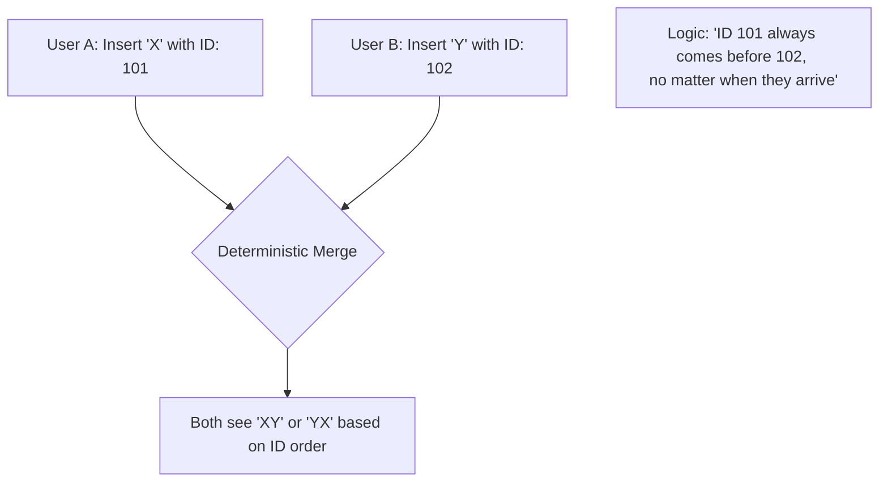

## Collaborative Solution

OT vs CRDT

---
hideInToc: true
---

## Operational Transformation (OT)

- First technique for real-time collaborative editing
- Used in Google Docs, Microsoft Office Online
- Server required to manage operations and resolve conflicts
- Scaling limit

<!--
Kỹ thuật đầu tiên cho chỉnh sửa cộng tác thời gian thực
Được sử dụng trong Google Docs, Microsoft Office Online
Yêu cầu máy chủ để quản lý các thao tác và giải quyết xung đột
Giới hạn về khả năng mở rộng
-->

---
hideInToc: true
layout: figure
figureUrl: crdt-the-hard-parts-ot-google-docs.png
figureCaption: 'CRDTs: The hard parts - https://youtu.be/x7drE24geUw?si=oQyxrZXkvUYsY7j6'
---

### OT Google Docs

<!--
Khi cả 2 cùng insert cùng lúc, gửi đến server, server sẽ nhận được 2 thao tác insert, 
và sẽ quyết định thứ tự của chúng dựa trên timestamp hoặc ID,
transform thứ tự (index) sao cho hợp lý, sau đó gửi lại cho cả 2 client để đồng bộ hóa.
-->

---
hideInToc: true
---

## Conflict-free Replicated Data Types (CRDT)

- Newer technique for real-time collaborative editing
- Used in Automerge, yjs, loro,...
- No server required, peer-to-peer synchronization
- Better scalability and offline support

<!--
Kỹ thuật mới hơn cho chỉnh sửa cộng tác thời gian thực
Được sử dụng trong Automerge, yjs, loro,...
Không cần máy chủ, đồng bộ ngang hàng (peer-to-peer)
Khả năng mở rộng tốt hơn và hỗ trợ ngoại tuyến
-->

---
hideInToc: true
---

### CRDT

<!--
CRDT có nhiều thuật toán, nhưng chung quy là:

Deterministic merge: Các thao tác được gán ID duy nhất và được sắp xếp theo thứ tự ID hay thời gian,
đảm bảo rằng tất cả các bản sao sẽ đồng bộ hóa về cùng một trạng thái cuối cùng, bất kể thứ tự nhận được các thao tác.

101 lúc nào cũng trước 102, bất kể khi nào chúng đến.
Ví dụ đang trên máy bay offline soạn 12 tiếng, trong thời gian đó (về cuối) cũng có 1 người khác đã edit.
Về nhà kết nối lại, sync, sẽ không bị xoá hết bởi người khác đã edit, cũng như sẽ được merge theo thứ tự của thuật toán.
-->

---
hideInToc: true
layout: figure
figureUrl: crdt-the-hard-parts-crdts.png
figureCaption: 'CRDTs: The hard parts - https://youtu.be/x7drE24geUw?si=oQyxrZXkvUYsY7j6'
---

### CRDTs

---
hideInToc: true
---

### CRDT properties

1. **Commutativity**: The order of operations does not affect the final state
   $$
   f(g(state)) = g(f(state))
   $$
2. **Associativity**: The grouping of operations does not affect the final state
   $$
    (a + b) + c = a + (b + c)
   $$
3. **Idempotence**: Applying the same operation multiple times has the same effect as applying it once
   $$
   f(f(state)) = f(state)
   $$

<!--
Các tính chất của CRDTs:
1. Giao hoán: Thứ tự của các thao tác không ảnh hưởng đến trạng thái cuối cùng
2. Kết hợp: Cách nhóm các thao tác không ảnh hưởng đến trạng thái cuối cùng
3. Idempotent (tính lũy đẳng): Áp dụng cùng một thao tác nhiều lần có cùng hiệu quả như áp dụng nó một lần
-->

---
layout: two-cols-header
hideInToc: true
---

### CRDT types

::left::

#### State-based CRDTs (CvRDTs)

- Replicas exchange their full state
- functions:
  - `initial()`: returns the initial state
  - `merge(state1, state2)`: merges two states
  - `update(state, action)`: applies an action to update the state
- Requires commutativity, associativity, idempotence

::right::

#### Operation-based CRDTs (CmRDTs)

- Replicas exchange operations directly
- functions:
  - `initial()`: returns the initial state
  - `update(state, action)`: applies an action to update the state
- Requires commutativity, associativity, and reliable delivery of operations

<!--
State-based CRDTs (hoặc CvRDTs) được định nghĩa bởi hai kiểu,
một kiểu cho trạng thái cục bộ và một kiểu cho các hành động trên trạng thái, cùng với ba hàm:
- một hàm để tạo ra trạng thái khởi tạo
- một hàm hợp nhất các trạng thái
- và một hàm để áp dụng một hành động nhằm cập nhật trạng thái

State-based CRDTs đơn giản là gửi toàn bộ trạng thái cục bộ của chúng đến các bản sao khác mỗi khi có cập nhật,
nơi trạng thái mới nhận được sẽ được hợp nhất (merge) vào trạng thái cục bộ.

Các CRDT dựa trên thao tác (CmRDTs) được định nghĩa mà không cần hàm hợp nhất (merge).
Thay vì truyền trạng thái, các hành động cập nhật được truyền trực tiếp đến các bản sao và được áp dụng.

Ví dụ, một CRDT dựa trên thao tác của một số nguyên đơn lẻ có thể phát tán các thao tác (+10) hoặc (−20).
Việc áp dụng các thao tác vẫn phải giao hoán và kết hợp được. +10 và −20 có thể được áp dụng theo bất kỳ thứ tự nào.

Tuy nhiên, thay vì yêu cầu việc áp dụng các thao tác là idempotent, CmRDTs cần đảm bảo connection collab phải ổn định, tinh cậy. Thiếu là mất, khác với state mất thì merge state sau cũng được.

Payload gửi đi nhỏ hơn State based.
-->
