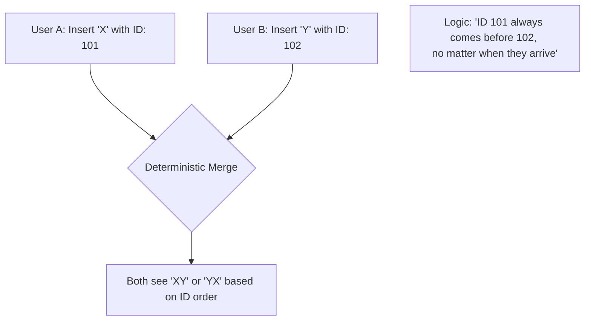

## Collaborative Solution

OT vs CRDT

---
hideInToc: true
---

## Operational Transformation (OT)

- First technique for real-time collaborative editing
- Used in Google Docs, Microsoft Office Online
- Server required to manage operations and resolve conflicts
- Scaling limit

---
hideInToc: true
layout: figure
figureUrl: crdt-the-hard-parts-ot-google-docs.png
figureCaption: 'CRDTs: The hard parts - https://youtu.be/x7drE24geUw?si=oQyxrZXkvUYsY7j6'
---

### OT Google Docs

---
hideInToc: true
---

## Conflict-free Replicated Data Types (CRDT)

- Newer technique for real-time collaborative editing
- Used in Automerge, yjs, loro,...
- No server required, peer-to-peer synchronization
- Better scalability and offline support

<!--
Không cần điều phối
-->

---
hideInToc: true
---

### CRDT

---
hideInToc: true
layout: figure
figureUrl: crdt-the-hard-parts-crdts.png
figureCaption: 'CRDTs: The hard parts - https://youtu.be/x7drE24geUw?si=oQyxrZXkvUYsY7j6'
---

### CRDTs

---
hideInToc: true
---

### CRDT properties

1. **Commutativity**: The order of operations does not affect the final state
   $$
   f(g(state)) = g(f(state))
   $$
2. **Associativity**: The grouping of operations does not affect the final state
   $$
    (a + b) + c = a + (b + c)
   $$
3. **Idempotence**: Applying the same operation multiple times has the same effect as applying it once
   $$
   f(f(state)) = f(state)
   $$

---
layout: two-cols-header
hideInToc: true
---

### CRDT types

::left::

#### State-based CRDTs (CvRDTs)

- Replicas exchange their full state
- functions:
  - `initial()`: returns the initial state
  - `merge(state1, state2)`: merges two states
  - `update(state, action)`: applies an action to update the state
- Requires commutativity, associativity, idempotence

<!--
State-based CRDTs (còn gọi là kiểu dữ liệu nhân bản hội tụ, hoặc CvRDTs) được định nghĩa bởi hai kiểu,
một kiểu cho trạng thái cục bộ và một kiểu cho các hành động trên trạng thái, cùng với ba hàm:
- một hàm để tạo ra trạng thái khởi tạo
- một hàm hợp nhất các trạng thái,
- và một hàm để áp dụng một hành động nhằm cập nhật trạng thái.
State-based CRDTs đơn giản là gửi toàn bộ trạng thái cục bộ của chúng đến các bản sao khác mỗi khi có cập nhật,
nơi trạng thái mới nhận được sẽ được hợp nhất vào trạng thái cục bộ.
-->

#### Operation-based CRDTs (CmRDTs)

- Replicas exchange operations directly
- functions:
  - `initial()`: returns the initial state
  - `update(state, action)`: applies an action to update the state
- Requires commutativity, associativity, and reliable delivery of operations

<!--
Các CRDT dựa trên thao tác (CmRDTs) được định nghĩa mà không cần hàm hợp nhất.
Thay vì truyền trạng thái, các hành động cập nhật được truyền trực tiếp đến các bản sao và được áp dụng.
Ví dụ, một CRDT dựa trên thao tác của một số nguyên đơn lẻ có thể phát tán các thao tác (+10) hoặc (−20).
Việc áp dụng các thao tác vẫn phải giao hoán và kết hợp được.
Tuy nhiên, thay vì yêu cầu việc áp dụng các thao tác là idempotent, cần có giả định mạnh hơn về hạ tầng truyền thông
tất cả các thao tác phải được chuyển đến các bản sao khác mà không bị trùng lặp.
-->
